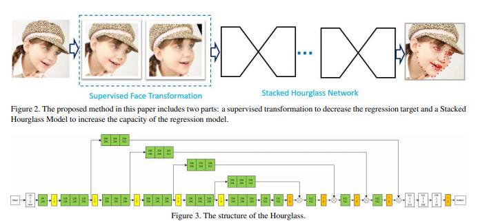

# Chainer Facial Hourglass
This is a Chainer re-implementation of [Stacked Hourglass Network for Robust Facial Landmark Localisation](http://openaccess.thecvf.com/content_cvpr_2017_workshops/w33/papers/Yang_Stacked_Hourglass_Network_CVPR_2017_paper.pdf) (authors: Jing Yang, Qingshan Liu, Kaihua Zhang) by [Atom Scott](atomscott.com).

## Overview

## Network Structure

## Dataset

We use the ibug-300 dataset

## Results

Comparison with other off-the-shelf networks.

## Training

## Inference

- Datasets - Ibug 300
